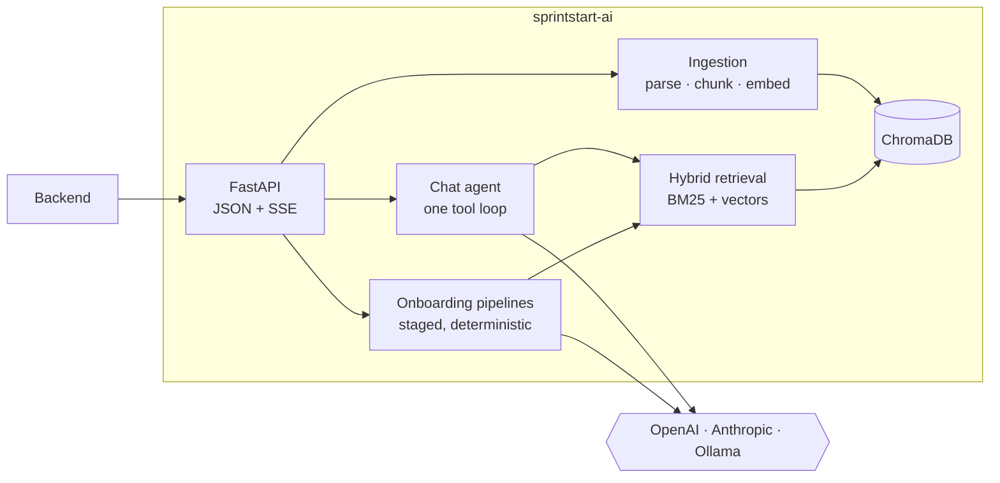

<div align="center">

# 🏃 sprintstart-ai

**Turn a project's scattered knowledge into onboarding that actually works.**

The AI and RAG engine behind [SprintStart](https://sprintstart.readthedocs.io/en/latest/): grounded answers, personalized onboarding paths and an AI mentor, built from your own code, issues and docs.

[](https://github.com/SprintStartProject/sprintstart-ai/actions/workflows/ci.yml)


[](https://sprintstart.readthedocs.io/en/latest/)

[Quick start](#-quick-start) · [Features](#-features) · [How it works](#-how-it-works) · [API](docs/api.md) · [Configuration](docs/configuration.md) · [Contributing](#-contributing)

</div>

---

New hires spend their first weeks hunting through a repo, a tracker, a wiki and a few PDFs. SprintStart ingests all of it, and this service is the part that reads it: a stateless FastAPI app that the [backend](https://github.com/SprintStartProject/sprintstart-backend) calls for anything that needs a model.

## ✨ Features

- 💬 **Ask the project.** Streaming Q&A with citations, scoped to one project. One agent, one tool loop.
- 🧭 **Onboarding paths.** Personalized per role and skill level, assembled from versioned blueprints.
- 🤝 **Buddy.** A tool-using mentor for new hires, with a team mode for PMs.
- 📋 **Orientation packets.** "How do I get my first PR merged here?", extracted from material you already have.
- 🗺️ **Diagrams.** Every box cites the chunk that proves it.
- 🌱 **Starter work.** Open issues mined for tasks that are safe for a newcomer.
- 🔍 **Insights.** Knowledge gaps, FAQ grouping, skill suggestions, answer grading.
- 🔌 **Bring your own model.** OpenAI and any compatible endpoint, Anthropic, or Ollama. Chat and embeddings can use different providers.

**Grounded, never invented.** Every generated step, box and section must cite a retrieved chunk. Anything unsupported is dropped, and with too little evidence the result is `skipped`.

**Fail-closed by project.** Retrieval is always scoped to a project, and a chunk with no project is invisible to everyone.

## 🚀 Quick start

You need Python 3.12+, [uv](https://docs.astral.sh/uv/) and an OpenAI API key.

```bash
git clone https://github.com/SprintStartProject/sprintstart-ai.git
cd sprintstart-ai
uv sync
cp .env.example .env
```

Set these in `.env`:

```env
LLM_BACKEND=openai
OPENAI_API_KEY=sk-...
OPENAI_CHAT_MODEL=gpt-4o-mini
OPENAI_EMBED_MODEL=text-embedding-3-small
CHROMA_PATH=./data/chroma
```

Run it:

```bash
uv run python -m src.main        # or: docker-compose up --build
```

Open **http://localhost:8000/docs** for the interactive API, or check `curl localhost:8000/api/v1/health`.

Try it from the terminal:

```bash
uv run python scripts/sprintstart.py ingest ./some/docs
uv run python scripts/sprintstart.py chat
```

> **Heads up:** `LLM_BACKEND` must be set. If it is empty the service falls back to Ollama.
>
> Prefer Anthropic or a local model? See [Configuration](docs/configuration.md).

## 🧠 How it works



Chat and the buddy are **agentic**: one flat loop that searches while the model asks, then streams the answer from the same conversation. Onboarding is a **pipeline** (`select → filter → retrieve → synthesize → validate → emit`), so a bad model output degrades to a blueprint-only path instead of breaking the request.

More in [Concepts](docs/concepts.md): project separation, hybrid retrieval, context-aware chunking and blueprints.

## 📚 Documentation

| | |
|---|---|
| [API reference](docs/api.md) | Every endpoint and the chat stream events |
| [Concepts](docs/concepts.md) | Project separation, retrieval, chunking, blueprints |
| [Configuration](docs/configuration.md) | Providers and environment variables |
| [FAQ grouping](docs/faq-grouping-concept.md) | How recurring questions are grouped |
| [Platform docs](https://sprintstart.readthedocs.io/en/latest/) | The full SprintStart documentation |

## 🛠️ Contributing

```bash
uv run ruff check . && uv run ruff format --check .   # lint
uv run pyright src/                                    # types (strict)
uv run pytest                                          # tests
```

CI runs `gitleaks → ruff + pyright → pytest`, so run the same before opening a PR. PRs to `main` must come from `dev` or `hotfix/*`. Conventions for humans and agents are in [`AGENTS.md`](AGENTS.md).

```
src/
├── api/         routes, schemas, SSE        ├── llm/         OpenAI, Anthropic, Ollama
├── agents/      chat agent and its tools    ├── store/       ChromaDB vector store
├── ingestion/   parsers and chunkers        ├── insights/    knowledge gaps, FAQ
├── rag/         hybrid retrieval, citations ├── skills/      skill suggestion
└── onboarding/  paths, buddy, diagrams, …   └── projects/    industry evaluation
```

## 🧩 Part of SprintStart

[**sprintstart-backend**](https://github.com/SprintStartProject/sprintstart-backend) (API, auth, persistence) · [**sprintstart-frontend**](https://github.com/SprintStartProject/sprintstart-frontend) (web UI) · **sprintstart-ai** (you are here)
