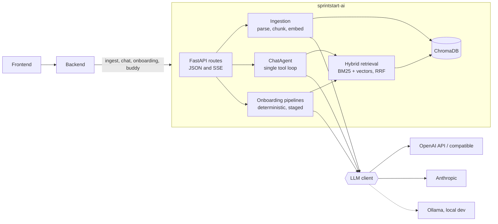

<h1 align="center">sprintstart-ai</h1>

<p align="center">
  <b>The AI and RAG service behind SprintStart.</b><br>
  It turns a project's scattered artifacts (code, issues, docs, PDFs, diagrams) into grounded answers, onboarding paths and mentoring.
</p>

<p align="center">
  <a href="https://github.com/SprintStartProject/sprintstart-ai/actions/workflows/ci.yml"></a>
  
  
  
  <a href="https://sprintstart.readthedocs.io/en/latest/"></a>
</p>

---

## What it does

A new hire joins a team and the knowledge they need is spread over a repo, a tracker, a wiki and a few PDFs. SprintStart ingests all of it and uses it to onboard people. This service is the AI half of that. It is a stateless FastAPI app: the [backend](https://github.com/SprintStartProject/sprintstart-backend) owns users, persistence and authorization, and calls this service for anything that needs a model.

| Capability | What you get |
|---|---|
| **Ask the project** | Streaming, cited Q&A over one project's corpus. One agent, one tool loop. |
| **Onboarding paths** | A personalized path assembled from versioned blueprints, with grounded steps. |
| **Buddy** | A tool-using mentor for new hires, plus a team mode for PMs. |
| **Orientation packets** | "Here is how to get your first PR merged", extracted from material the project already has. |
| **Diagrams** | Subject-scoped diagrams where every box cites the chunk that proves it. |
| **Starter work** | Open issues mined for tasks that are safe for a newcomer. |
| **Insights** | Knowledge-gap detection, FAQ grouping, skill suggestion, answer grading, industry evaluation. |

Two rules hold across the whole service:

- **Grounded, never invented.** Generated steps, boxes and sections must cite a retrieved chunk. Ungrounded output is dropped, not softened. When there is not enough evidence, the result is `skipped`.
- **Fail-closed project separation.** Every retrieval-backed request is scoped to a project. A chunk with no project association is invisible to everyone.

## How it fits together



**Two shapes of AI, on purpose:**

- **Chat and buddy are agentic.** `ChatAgent` runs one flat loop over a single message list. It searches while the model asks, then streams the answer from the same conversation. New abilities are new `Tool`s in `src/agents/tools/`, not sub-agents.
- **Onboarding is a pipeline, not an agent.** `select → filter → retrieve → synthesize → validate → emit`. A bad LLM output degrades to a blueprint-only path instead of breaking the request.

## Quick start

You need Python 3.12+, [uv](https://docs.astral.sh/uv/), and an LLM provider. The default setup is the **OpenAI API**. Any OpenAI-compatible endpoint (Azure, LiteLLM, OpenRouter, vLLM) works the same way.

```bash
uv sync
cp .env.example .env          # then set the values below
uv run python -m src.main     # http://localhost:8000, interactive docs at /docs
```

Minimal `.env`:

```env
LLM_BACKEND=openai            # required: unset falls back to Ollama
OPENAI_API_KEY=sk-...
OPENAI_CHAT_MODEL=gpt-4o-mini
OPENAI_EMBED_MODEL=text-embedding-3-small   # no default, must be set for ingestion and retrieval
CHROMA_PATH=./data/chroma     # unset means in-memory, data is lost on restart
```

`OPENAI_BASE_URL` defaults to `https://api.openai.com/v1`. Point it at a proxy or another provider to use something else. Set `OPENAI_VISION_MODEL` to enable image captioning.

Or with Docker:

```bash
cp .env.example .env          # same values as above
docker-compose up --build
```

Then check that it is alive:

```bash
curl localhost:8000/api/v1/health      # 503 if the LLM backend is unreachable
```

### Other providers

**Anthropic** for chat has no embeddings API, so pair it with an OpenAI-compatible embedding backend:

```env
LLM_BACKEND=anthropic
ANTHROPIC_API_KEY=...
EMBED_BACKEND=openai
OPENAI_API_KEY=...
OPENAI_EMBED_MODEL=...
```

`EMBED_BACKEND` can split embeddings off to a different provider with any backend. `OPENAI_EMBED_BASE_URL` and `OPENAI_EMBED_API_KEY` override the endpoint and key for embeddings only.

**Ollama** is supported for small local experiments, but running it on consumer hardware does not hold up against a full project corpus. If you do use it:

```bash
ollama pull llama3.2 && ollama pull nomic-embed-text
```

```env
LLM_BACKEND=ollama
OLLAMA_BASE_URL=http://localhost:11434
OLLAMA_MODEL=llama3.2
OLLAMA_EMBED_MODEL=nomic-embed-text
OLLAMA_NUM_CTX=32768          # Ollama's default silently truncates large prompts
```

In Docker, set `OLLAMA_BASE_URL=http://host.docker.internal:11434` to reach Ollama on the host.

## Try it from the terminal

A small CLI talks to a running service, so you can use it without the rest of the platform:

```bash
uv run python scripts/sprintstart.py ingest ./some/docs      # ingest a file or directory
uv run python scripts/sprintstart.py chat                    # interactive Q&A
uv run python scripts/sprintstart.py onboard -a backend -e junior
uv run python scripts/sprintstart.py corpus search "how do I run the tests?"
uv run python scripts/chunk_inspector_cli.py <file>          # offline: see how a file gets chunked
```

## API

Everything lives under `/api/v1`. Streaming endpoints use Server-Sent Events. Full schemas are at `/docs` on a running instance.

<details open>
<summary><b>Ingestion and the vector store</b></summary>

| Method | Path | Purpose |
|---|---|---|
| `POST` | `/ingest` | Parse, chunk and embed one document. Text, code, PDF and images (base64, needs a vision model; without one, images yield no chunks). Re-ingesting an `artifact_id` replaces its chunks. |
| `POST` | `/ingest/sync` | Batch-ingest a completed GitHub ingestion run. |
| `POST` | `/artifacts/projects/sync` | Rewrite which projects an indexed artifact belongs to. |
| `DELETE` | `/projects/{project_id}/memberships` | Drop a deleted project from the whole corpus. |
| `PATCH` | `/connectors/{id}`, `/sources/{id}` | Enable or disable a connector or its sources. |
| `GET` | `/vector-db/status`, `/vector-db/chunks`, `/vector-db/artifacts/{id}/chunks` | Inspect what is indexed. |
| `POST` | `/vector-db/search` | Search the index directly. |
| `DELETE` | `/vector-db/artifacts/{id}` | Delete an artifact's chunks. |

</details>

<details open>
<summary><b>Chat and buddy</b></summary>

| Method | Path | Purpose |
|---|---|---|
| `POST` | `/chat` | Cited, streamed answer scoped to a `projectId`. |
| `POST` | `/generate-title` | Short title from a prompt. |
| `POST` | `/artifacts/{id}/summary` | Streamed summary of one artifact. |
| `POST` | `/onboarding/buddy/open/stream` | Open a buddy visit and greet the hire. |
| `POST` | `/onboarding/buddy/agent` | One tool-using buddy turn (stateless). |
| `POST` | `/onboarding/buddy/compact` | Fold older turns into the mentor's durable memory note. |

</details>

<details open>
<summary><b>Onboarding</b></summary>

| Method | Path | Purpose |
|---|---|---|
| `POST` | `/onboarding/path`, `/onboarding/path/yaml` | Personalized path, as SSE or YAML. |
| `POST` | `/onboarding/blueprints/generate` | Draft blueprints from a project's corpus. |
| `POST` | `/onboarding/phase`, `/onboarding/phase/stream` | Fill one `AI_ENHANCED` blueprint phase with steps and a knowledge check. |
| `POST` | `/onboarding/orientation`, `/onboarding/orientation/stream` | Task-scoped orientation packet. |
| `POST` | `/onboarding/diagram`, `/onboarding/diagram/stream` | Subject-scoped, cited diagram. |
| `POST` | `/onboarding/starter-work/mine`, `/onboarding/starter-work/mine/stream` | Mine open issues for starter-work candidates. |

</details>

<details open>
<summary><b>Insights and helpers</b></summary>

| Method | Path | Purpose |
|---|---|---|
| `POST` | `/insights/knowledge-gaps/detect` | Documentation-coverage gaps per component. |
| `POST` | `/insights/faq/group`, `/classify`, `/groups/merge` | Group recurring questions, file a new one, propose merges. |
| `POST` | `/skills/suggest` | Suggest skills for a project role. |
| `POST` | `/grade-answers` | Semantically grade short-text knowledge-check answers. |
| `POST` | `/projects/{id}/industry/evaluate` | Infer a project's industry or domain from its artifacts. |
| `GET` | `/health` | Service and LLM backend health. |

</details>

### Chat stream events

`/chat` streams newline-delimited JSON events:

| Event | Meaning |
|---|---|
| `tool_use` | A capability the agent invoked, in order (`name`, `kind`). |
| `reasoning` | A live reasoning fragment. Never part of the answer or persisted content. |
| `token` | One fragment of the answer. |
| `citation` | A source chunk used for the answer. |
| `done` | End of stream. |
| `error` | Emitted instead of the above on failure. |

## Concepts worth knowing

<details>
<summary><b>Project separation</b></summary>

Artifacts belong to one or more projects, and every retrieval-backed feature is scoped to them.

- **Ingest** records membership via `projectIds`, written into chunk metadata as a delimited `project_ids` string plus one `project:<id>` marker key that Chroma can filter on server-side.
- **Retrieval** applies the project filter to both halves of hybrid search (Chroma `where` clause and the BM25/in-memory path in `rag/filters.py`), and to the corpus-scanning `grep` and `fetch_file` tools.
- **Requests** must name the project. `projectId` is required on chat, onboarding, blueprint generation and the insights endpoints. The backend authorizes the caller and passes it through.
- **Blueprints** are project-qualified: `project:<projectId>|global` and `project:<projectId>|area:<name>`. Anything scoped to another project, or unqualified, is ignored.

Chunks ingested before `projectIds` was sent are unreachable. Re-run a full `POST /ingest/sync` to backfill them.

</details>

<details>
<summary><b>Hybrid retrieval</b></summary>

Retrieval fuses BM25 and vector search with reciprocal rank fusion (`rag/hybrid.py`). The BM25 index is cached in memory behind a lock, since a turn's tool calls run concurrently.

</details>

<details>
<summary><b>Context-aware chunking</b></summary>

`POST /ingest` can optionally let an LLM choose chunk boundaries (`semantic_boundaries`) and prepend a short situating context block to chunks that need one (`contextualize`, in the spirit of Anthropic's Contextual Retrieval). Both flags default to `false`, which skips the LLM entirely and uses the plain character chunker.

When enabled, it still falls back to the plain chunker if the content exceeds `CONTEXT_AWARE_CHUNKING_MAX_CHARS`, the LLM is unreachable, or its response fails validation. No ingest request fails because of it. Only text and PDF are affected (PDFs are processed per page), and `/ingest/sync` always uses the plain chunker.

Resulting chunks carry `has_context_block`, `context_block_range`, `has_overlap` and `overlap_range` metadata.

</details>

<details>
<summary><b>AI-proposed blueprints</b></summary>

Paths are assembled from versioned blueprints with a `source` of `authored` (human) or `generated` (drafted from the corpus). The backend owns persistence, versioning and rollback. This service only returns generated data.

Generation is **grounded** (every step cites a chunk), **idempotent** (an unchanged corpus fingerprint is a no-op) and protects human-owned invariants (it can never remove or downgrade a `required` or `invariant: true` step).

A refresh is O(number of scopes): one hybrid retrieval and one LLM call per scope, so *global + N areas* costs N+1 of each. It is a schedulable batch job and never runs on the latency-sensitive `/onboarding/path` request path.

</details>

## Configuration

`.env.example` is the reference, with every variable commented. The ones you will touch most:

| Variable | Purpose |
|---|---|
| `LLM_BACKEND` / `EMBED_BACKEND` | `openai` (also LiteLLM, OpenRouter, any compatible endpoint), `anthropic` or `ollama`. Set `LLM_BACKEND` explicitly. `EMBED_BACKEND` is optional and splits embeddings off. |
| `OPENAI_API_KEY`, `OPENAI_BASE_URL`, `OPENAI_CHAT_MODEL`, `OPENAI_EMBED_MODEL`, `OPENAI_VISION_MODEL` | OpenAI-compatible backend. Chat model defaults to `gpt-4o-mini`. The embedding model has no default. |
| `OPENAI_MAX_TOKENS`, `OPENAI_REASONING_MAX_TOKENS` | Optional output limit and opt-in reasoning budget for streamed answers. The limit must exceed the reasoning budget. |
| `OPENAI_EMBED_DIMENSIONS` | Fixed vector size for models that support it. Must match the existing Chroma collection, so changing it means re-creating the collection. |
| `ANTHROPIC_API_KEY`, `ANTHROPIC_CHAT_MODEL`, `ANTHROPIC_THINKING_BUDGET_TOKENS` | Anthropic backend and its opt-in reasoning budget. |
| `OLLAMA_BASE_URL`, `OLLAMA_MODEL`, `OLLAMA_EMBED_MODEL`, `OLLAMA_VISION_MODEL`, `OLLAMA_NUM_CTX` | Ollama endpoint, models and context window. |
| `CHROMA_PATH` | Persistent ChromaDB directory. Unset means in-memory, and data is lost on restart. |
| `CHUNK_SIZE`, `CHUNK_OVERLAP` | Chunking. |
| `INGEST_CONCURRENCY`, `INGEST_MAX_CONTENT_LENGTH`, `INGEST_MAX_BINARY_BYTES` | Ingest limits. Oversized payloads are skipped (`chunk_count=0`). |
| `LLM_TIMEOUT_SECONDS` | Request timeout for every backend (default 600, `0` disables). |
| `AGENT_DEBUG` | `1` logs each agent's reasoning and tool calls to stderr. |

## Project layout

```
src/
├── api/          FastAPI app, dependency injection, schemas, SSE helpers, routes/
├── agents/       ChatAgent and its tools (retrieve, grep), SSE orchestrator
├── ingestion/    Parsers (text, PDF, code via tree-sitter, image), chunkers, metadata store
├── rag/          Hybrid retrieval, filters, citations, prompts
├── onboarding/   Paths, blueprints, buddy, orientation, diagrams, phases, starter work
├── insights/     Knowledge gaps and FAQ grouping
├── skills/       Skill suggestion
├── projects/     Industry evaluation
├── llm/          LLMClient protocol: OpenAI-compatible, Anthropic, Ollama, split client
└── store/        VectorStore protocol and the ChromaDB implementation
scripts/          Terminal client and chunk inspector
tests/            Mirrors src/, with fakes in tests/stubs/
```

## Development

```bash
uv run ruff check .                 # lint
uv run ruff format --check .        # format check
uv run pyright src/                 # types (strict)
uv run pytest                       # tests
uv run pytest -m integration        # end-to-end, needs Ollama
```

CI runs `gitleaks → ruff lint + format + pyright → pytest`, in that order. Run the same before opening a PR.

A few conventions:

- `src` is on the pytest path, so import `from agents.base import Agent`, never `from src.agents...`.
- Do not assume a single provider. Go through the `LLMClient` protocol.
- Tools must be read-only and thread-safe, and their results must carry the chunk text so the answer needs no second pass.
- Reuse `StubLLMClient`, `ScriptedLLMClient` and `StubVectorStore` instead of hand-rolling mocks.
- `data/` is gitignored. Do not commit local Chroma state.

More detail for contributors, human or agent, is in [`AGENTS.md`](AGENTS.md).

### Branches and releases

PRs to `main` must come from `dev` or `hotfix/*`. A push to `main` or `dev` publishes a Docker image to `ghcr.io/sprintstartproject/sprintstart-ai`.

## Part of SprintStart

| Repo | Role |
|---|---|
| [sprintstart-backend](https://github.com/SprintStartProject/sprintstart-backend) | API, auth, persistence, orchestration |
| [sprintstart-frontend](https://github.com/SprintStartProject/sprintstart-frontend) | Web UI |
| **sprintstart-ai** | This service |

Full documentation lives at [sprintstart.readthedocs.io](https://sprintstart.readthedocs.io/en/latest/).
